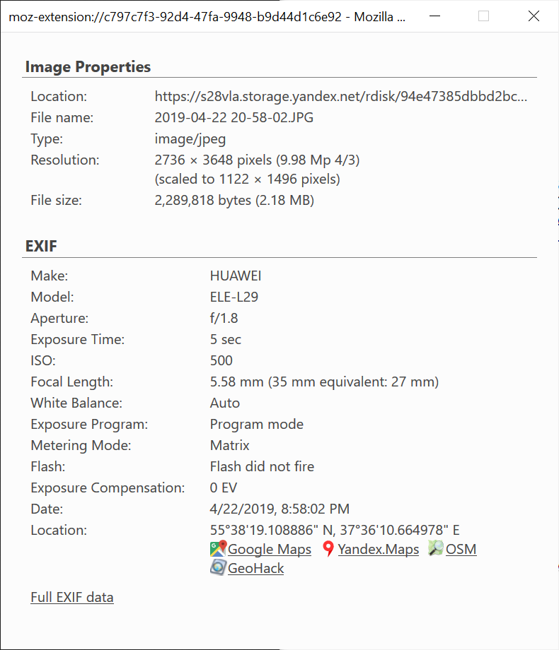

ExImageInfo
===========

Extension for EXIF and image properties in a classic Firefox representation.

[More screenshots](screenshots/)

EXIF functionality is based on exif.js library.\
https://github.com/exif-js/exif-js\
https://github.com/patosai/exif-js

