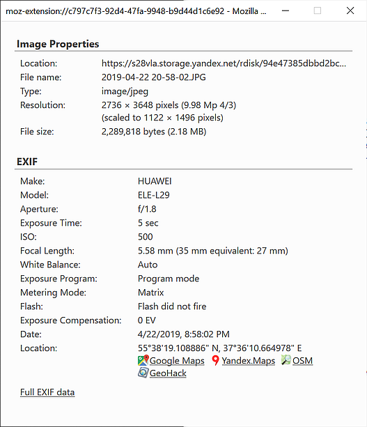

ExImageInfo
===========

Extension for EXIF and image properties in a classic Firefox representation. ExImageInfo can be installed from [addons.mozilla.org](https://addons.mozilla.org/ru/firefox/addon/eximageinfo/).

EXIF functionality is based on exif.js library.\
https://github.com/exif-js/exif-js \
https://github.com/patosai/exif-js

\
[More screenshots](screenshots/)